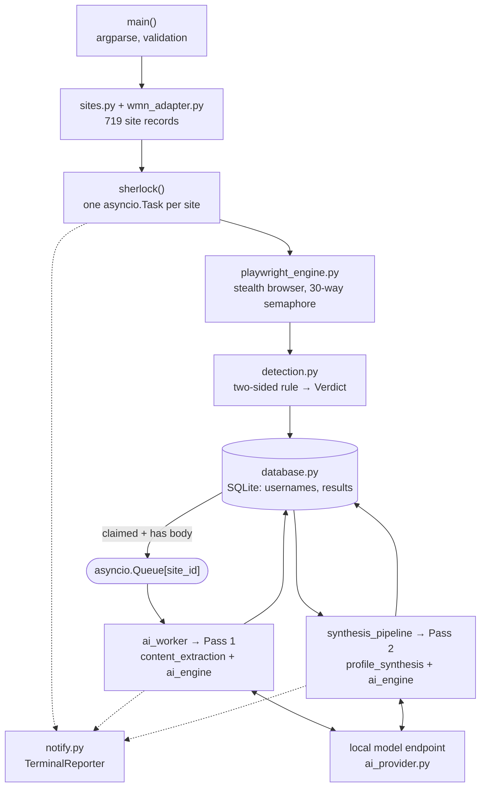
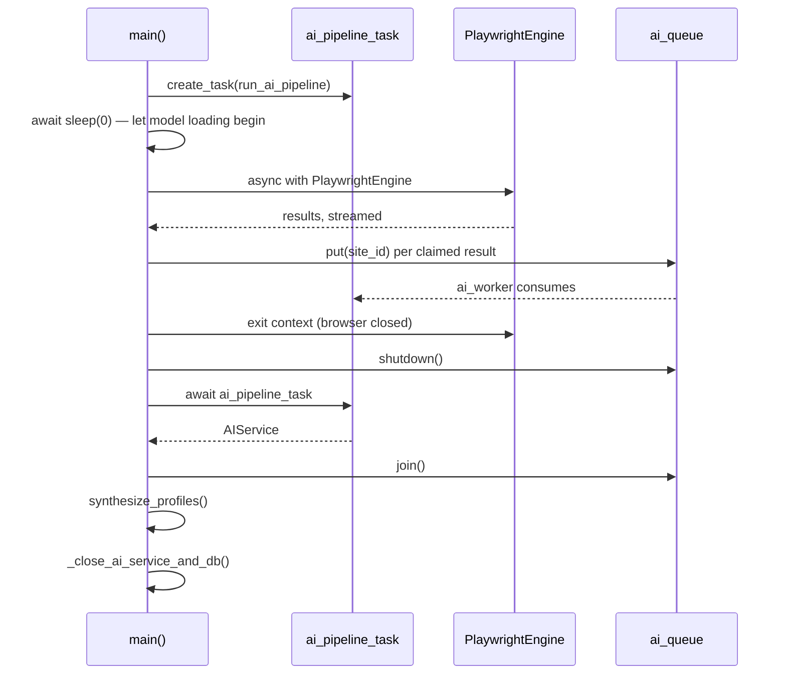

# Architecture

How this codebase is put together, why the load-bearing parts are shaped the
way they are, and which decisions are expensive to reverse.

Written for a maintainer — someone who needs to change something here and wants
to know what else moves. It documents behaviour as of `369247fc`
(`feat/wmn-migration`). Where it and a comment disagree, the code wins; where it
and `README.md` overlap, the README is for users and this is not. (The README
moved from `docs/` to the repository root in `1447c081`.)

Provenance is out of scope: see [NOTICE.md](../NOTICE.md) for what is inherited
from upstream and what is new here.

---

## 1. The shape of it

One command does three things that used to be three tools: it enumerates
accounts, it stores what it found, and it reads what it found. Those stages are
not sequential phases — the analysis runs *concurrently with* the scan, which is
the single fact that explains most of the complexity in `sherlock.py`.



Three properties are worth naming up front, because nearly every design choice
below follows from one of them:

1. **A wrong answer costs more than a missing one.** This is an investigative
   tool; a fabricated account is worse than an unfound one. Detection refuses to
   guess, synthesis segregates uncertain evidence, and both surface *why*.
2. **One failure must never cost the run.** A scan is minutes of work against
   700+ third parties. Any single site, extraction, or cleanup step can fail
   without aborting anything else.
3. **Nothing leaves the machine except to the sites being scanned and the local
   model endpoint.** The AI is local by construction, not by configuration.

---

## 2. Module map

| Module | Responsibility | Notes |
| - | - | - |
| `sherlock.py` | CLI, orchestration, async lifecycle | 1.5k lines; the only place that knows about all the others |
| `sites.py` | Load a manifest into `SiteInformation` objects | Sniffs WMN vs. legacy format |
| `wmn_adapter.py` | WhatsMyName → internal site record | Pure; total (rejects, never raises) |
| `detection.py` | Two-sided rule → `Verdict` | Pure: no I/O, no imports from the engine |
| `playwright_engine.py` | Stealth-browser and API fetching | Async context manager; owns concurrency |
| `database.py` | SQLite persistence | Single writer lock; idempotent schema |
| `content_extraction.py` | HTML → bounded model input | Off-thread; CPU-bound |
| `ai_engine.py` | Both passes' prompts, schemas, validation | Largest AI module; owns both contract hashes |
| `profile_synthesis.py` | Pass 2 data model and deterministic merging | Pure; no model calls |
| `synthesis_pipeline.py` | Pass 2 cache gate and orchestration | Thin; the seam between DB and `AIService` |
| `ai_provider.py` | LM Studio REST client | The only module that speaks HTTP to a model |
| `ai_config.py` / `ai_setup.py` | Persistent endpoint config and its wizard | Config lives in the user config dir |
| `investigation_context.py` | `--anchor` parsing and deduplication | Anchors are per-run, never persisted |
| `pass_one_runtime.py` | Seed known key names from prior extractions | Keeps Pass 1 key naming stable across sites |
| `notify.py` | Every byte of terminal output | `rich`-based; no other module prints |
| `result.py` | `QueryStatus`, `QueryResult` | Inherited from upstream |

**The dependency rule that matters:** `detection.py`, `wmn_adapter.py`, and
`profile_synthesis.py` are pure. They import no engine, no database, no
provider. Everything they decide is reproducible from their arguments, which is
why they carry the highest test density in the suite. Keep them that way.

---

## 3. The scan pipeline

### 3.1 Manifest load

`SitesInformation` (`sites.py:94`) resolves one of three sources, in order of
precedence:

- `--json <path|url|PR number>` — an explicit manifest. A bare number is
  interpreted as an *upstream* PR and resolved to a raw URL at that PR's head
  commit (`sherlock.py:1217`).
- `--local` — guarantees the bundled manifest and disables exclusions.
- Default — the bundled WhatsMyName dataset, `resources/wmn-data.json`.

The default path makes **no network call at all**. That is a change from
upstream, where the manifest and a false-positive exclusions list were both
fetched at runtime.

The format is sniffed rather than configured (`is_wmn_manifest`, `sites.py:25`):
an object with a `sites` array is WMN, a flat object keyed by site name is the
legacy format. Both still load, so `--json` keeps working against upstream PRs.

**Exclusions only apply to legacy manifests.** `_load_wmn` returns before the
exclusion-fetching block ever runs (`sites.py:177`). This is deliberate: the
exclusions list existed to patch the legacy dataset's false positives, and a
two-sided rule that stops matching now reports UNKNOWN instead of a false hit,
so there is nothing left to subtract. `--ignore-exclusions` is therefore a no-op
on the default manifest.

Adaptation happens at load time and is never written back, so the vendored
dataset stays byte-identical to upstream's — a licensing property, not just
tidiness (see NOTICE.md).

Of 720 upstream entries, **719 adapt cleanly**; one is rejected as
`valid=false`. Rejections are collected on `SitesInformation.rejected` rather
than raised, so dataset rot is reportable without costing the scan the other
719. (A default run then drops 39 NSFW entries unless `--nsfw` is passed.)

### 3.2 Transport choice

Each site is fetched one of two ways, chosen by `preferred_transport`
(`wmn_adapter.py:85`) and refined in `sherlock()`:

| Condition | Transport | Why |
| - | - | - |
| `protection` present in the record (58 sites) | browser | The dataset already knows the target has anti-automation |
| `urlProfile` differs from `url` (187 remaining) | api | `uri_check` is an API; the profile lives elsewhere |
| otherwise (532 sites) | browser | `uri_check` *is* the page a human opens |
| explicit `request_method` (22 POST sites) | api, always | `page.goto` cannot issue anything but a GET |

The asymmetry is intentional and was learned the hard way. An API endpoint is
cheap and safe to trust. An HTML page is not: a login wall or block page renders
as an ordinary 200 and can contain the rule's own miss marker. Instagram reports
a *confident* CONFIRMED-missing for a real account when fetched over the raw API
path — a wrong answer with no uncertainty attached, which no
retry-when-undecided fallback can catch, because nothing looked uncertain.

Every request retrieves a body. The legacy manifest's status-only rules were
fetched with HEAD, which is why 54% of confirmed hits used to reach the AI
pipeline with nothing in them. A marker cannot be matched against a HEAD.

### 3.3 Fetch

`PlaywrightEngine` is an async context manager wrapping `cloakbrowser`. It owns:

- **Concurrency** — one `asyncio.Semaphore(30)` shared by both fetch paths.
- **Two fetch methods** — `fetch_with_page` (new page, `goto`, `page.content()`)
  and `fetch_with_api` (`APIRequestContext`, supports POST bodies).
- **A response shim** — both paths attach `.text` and `.elapsed` to the
  Playwright response object so downstream code sees one shape.
- **Cleanup that cannot leak** — `_close_resources` nulls its handles first,
  then attempts context and browser close independently, chaining the second
  failure onto the first as a note rather than dropping it.

`wait_until="domcontentloaded"`, not `"load"`. Markers live in the initial HTML,
and sites that never quiesce otherwise burn the full timeout — Telegram times
out at 45s on `load` and resolves instantly on `domcontentloaded`.

The engine also carries a `cancellation_callback`, wired to AI teardown. See §8.

### 3.4 Detection

`detection.py` evaluates one rule against one response and returns a `Verdict`
of `(exists: bool | None, confidence, reason)`. The full ordering is documented
in that module's docstring; the architecturally significant parts:

- **`exists is None` is a first-class outcome.** It becomes `QueryStatus.UNKNOWN`
  with the verdict's reason attached as context. The legacy model could only
  describe absence, so CLAIMED was the default and any 2xx was a hit — making a
  soft-404 and a real profile indistinguishable, and a stale rule and a found
  account indistinguishable. Refusing to guess is the entire point of the
  migration.
- **A marker outranks a status code.** Codes get rewritten by CDNs, rate
  limiters, and WAFs; markers are chosen per site.
- **Contradiction is not evidence.** Disagreeing signals produce UNKNOWN, never
  an average.
- **`NON_CONTENT_CODES` are checked before any marker.** A 403 or 503 did not
  deliver the resource, so its body is not evidence at all — a challenge page can
  contain the very string the rule treats as a hit marker. Rules that genuinely
  expect such a code are honoured.
- **The miss side is deliberately more permissive than the hit side**, because
  the two errors are not equally costly.

`QueryConfidence` (CONFIRMED / PROBABLE / AMBIGUOUS) is orthogonal to
`QueryStatus`: the status is what was decided, the confidence is how much
agreed. It exists so consumers can weight evidence instead of treating every hit
as equally true.

`is_rule_stale(verdict)` is the hook for counting dataset rot across scans — a
distinction the negative-only model could not draw.

### 3.5 The two extra fetches

Both are conditional, both are cheap in aggregate, and both exist because
*detection and extraction want different things*.

**Retry on undecided** (`_retry_on_profile_page`, `sherlock.py:116`) — an API
result that matched neither side of its rule gets one re-probe against the
human-facing profile page, which carries markup the API never returns. Only
undecided GET results with a distinct `urlProfile` pay for it. Failure is
swallowed: this is a bonus attempt on an already-undecided result.

**Profile fetch for AI** (`_fetch_profile_content`, `sherlock.py:149`) — a
*confirmed* hit found over an API gets a second fetch of the profile page,
because the API's JSON envelope contains nothing worth extracting. Only
confirmed hits pay for the expensive render. Failure returns `None` and the
already-correct result stands.

### 3.6 Persist and enqueue

`db.save_result` upserts on `UNIQUE(username_id, site_name)` and returns the row
id. A result is enqueued for Pass 1 only when it is CLAIMED, has a non-empty
body, and AI is enabled. `scheduled_ai_ids` guards against double-enqueue.

**The gotcha that looks like a bug:** with no `--site`, a scan skips every site
already saved for that username (`sherlock.py:1356`). A second run that "does
nothing" is almost always this. Pass `--fresh` to re-probe every site, or
`--site` to re-probe a chosen few.

`--fresh` turns off the resume filter *and* passes `force_ai_extraction=True`,
so a fresh run re-probes every site and re-extracts every hit rather than
reusing the stored extraction. It previously did only the first half — rows
upsert on `UNIQUE(username_id, site_name)` and `save_result` keeps a cached
`ai_extraction` when both `status` and `response_text` come back unchanged —
which made it the one flag that could not apply a newly configured model: full
scan cost, byte-identical AI output. It is rejected with
`--ai-synthesize-only`, which performs no scan.

---

## 4. Storage

Two tables, created idempotently on connect (`_initialize_tables`,
`database.py:124`):

```
usernames(id, username UNIQUE, profile_summary,
          profile_summary_input_hash, profile_summary_updated_at,
          last_scanned_at)

results(id, username_id → usernames.id, site_name, site_url,
        status, status_code, query_time_ms, error_context, response_text,
        ai_extraction, ai_extraction_contract_hash, ai_extraction_model,
        confidence, scanned_at,
        UNIQUE(username_id, site_name))
```

`ai_extraction_model` is provenance, never a cache key. The contract hash is
deliberately model-independent, and must stay that way: folding the model into
it would invalidate every extraction on disk for every username the moment
anyone tried a second model, and invalidate it again on switching back. A
different model's extraction is still valid against the current contract — it
is not stale, only possibly better or worse, and that judgment belongs to the
user. So the model is recorded and reported (scan warning, `show`, `--json`),
and `--fresh` is the opt-in redo. NULL means the row predates the column.

Four things about this layer are load-bearing:

**There is no migration framework.** Columns are added by `_ensure_column`,
which reads `PRAGMA table_info` and `ALTER TABLE`s if absent. Adding a nullable
column is safe; renaming, retyping, or dropping one is not supported and would
need a real migration path.

**All writes go through one `asyncio.Lock`.** Every mutating method takes
`self._write_lock`, and every one rolls back on `BaseException` before
re-raising. Pass 1 workers write concurrently with the scan, so this is not
optional.

**Cache invalidation is a database concern, not a caller concern.** The upsert's
`CASE` expressions clear `ai_extraction` when the status or response text
changed, or when `force_ai_extraction` is set — so a changed page automatically
invalidates its extraction. Any write that touches an extraction also nulls the
owning username's `profile_summary_input_hash`, which invalidates Pass 2. A
caller cannot forget to do this because a caller never does it.

**The database follows the user, not the working directory.**
`default_database_path()` resolves to the per-user data dir
(`%LOCALAPPDATA%\sherlock\sherlock.db` on Windows), overridable with
`SHERLOCK_DB`. A relative path would start an empty database whenever the tool
was invoked from a different directory, silently discarding the extraction cache
and scattering scan data. This was a real regression that has already been fixed
once; do not reintroduce it. The same rule applies to `ai_config_path()` and
`SHERLOCK_CONFIG`.

`response_text` is stored in full. It is the input to Pass 1, so retention is
what makes re-extraction possible without re-scanning — and it is also why the
database is the most sensitive artifact this tool produces.

---

## 5. The two AI passes

Both run against a local endpoint configured once by `sherlock setup ai`.
`AIService` (`ai_engine.py:642`) owns prompts, schemas, and validation;
`LMStudioProvider` owns the wire.

### Pass 1 — per-site extraction

Driven by `ai_worker` (`sherlock.py:352`), one job per claimed result:

```
site_id → get_ai_extraction_job → extract_profile_content (off-thread)
        → AIService.extract_profile → sanitize → update_result_ai_extraction
```

- **`content_extraction.extract_profile_content`** reduces raw HTML to bounded
  metadata plus main content, capped at 18,000 characters. It runs via
  `asyncio.to_thread` because it is CPU-bound and would otherwise stall the event
  loop mid-scan. It classifies its own outcome (`extracted`,
  `missing_profile_page`, `breach_artifact`, `empty_response`,
  `no_extractable_content`) and short-circuits on the ones that cannot contain a
  profile. Empty content is written back as `{}` with the current contract hash —
  a recorded "nothing here", not a retry.
- **The response schema is open-keyed**: `dict[SafeExtractionKey,
  ProfileFactList]`, keys constrained to `^[a-z][a-z0-9_]{0,63}$`. The model
  names its own fields rather than filling a fixed form.
- **`PassOneKeyRegistry`** feeds previously-used key names back into subsequent
  prompts for the same username, so twelve sites do not produce twelve spellings
  of "location". It is hydrated once per username from prior extractions at the
  current contract hash (`pass_one_runtime.py`).
- **Sanitation is deterministic and runs after validation**
  (`sanitize_pass_one_extraction`, `ai_engine.py:526`). It drops telemetry-ish
  keys (`*_count`, `total_*`, follower metrics), placeholder and generic UI
  values, the searched username echoed back, and the current site's own URL. It
  also recovers a name from page metadata when the model missed one. The model
  is not trusted to have obeyed the prompt.

### Pass 2 — cross-site synthesis

`synthesis_pipeline.synthesize_username_profile` loads every Pass 1 extraction
for a username, validates each against the *live* schema, and splits them into
usable extractions, pending site ids, and invalid payloads. Then it branches:

**Without `--anchor`, no model runs at all.** `aggregate_synthesis`
(`profile_synthesis.py:355`) deterministically merges every extraction and
returns a profile carrying an explicit warning that values may describe
different people who share the username. This is the default path.

**With `--anchor`, the model resolves identity, one site at a time.** For each
extraction, `_assess_target` asks the model a single question — does this site's
facts match the anchors and the profile built so far — and gets back one of
`strong_match` / `unsure` / `reject`. Two sweeps:

1. First pass in `site_id` order. `strong_match` merges into the strong profile
   immediately; `unsure` is set aside; `reject` is excluded.
2. Second sweep re-asks the deferred `unsure` sites against the now-richer strong
   profile. A site that only looked ambiguous because the profile was empty can
   be promoted.

Both output profiles are then **rebuilt from the final decisions**, not
incrementally patched, so a site promoted in sweep 2 does not end up in both.

The result (`ProfileSynthesis`, `schema_version: 8`) keeps `strong_profile` and
`unsure_profile` separate, records a `SourceDecision` per site
(`included`/`excluded`/`ignored`/`failed`), and attaches per-value provenance —
which site ids contributed each value. A displayed fact can always be traced to
its sources.

Failure is per-site: one failed decision becomes a `failed` disposition plus a
warning, and the other sites still merge. A `ProviderWideError` (the endpoint
went away) stops further calls and marks the remainder `failed` rather than
hammering a dead endpoint 300 times. Pass 2's per-request input is capped at
12,000 bytes; exceeding it fails that site's decision, not the run.

### Both passes

`_respond_structured` (`ai_engine.py:1043`) is the single call path: it appends
the compact JSON Schema to the system prompt, validates the response into a
Pydantic model, applies an optional transform, and — in a `finally` — emits an
`AIRequestTrace` with timings, token counts, and any validation error code.
Tracing happens on both success and failure, and a raising trace callback is
swallowed: **reporting must never change extraction behaviour.**

Pass 1 requests native reasoning **off** (it has its own `reasoning` field in the
schema); Pass 2 requests it **on**.

---

## 6. The two caching gates

Everything expensive is cached, and exactly two hashes decide whether a cache
entry is still valid. Both are content-addressed: change an input, and the
affected work re-runs by itself.

### `pass_one_contract_hash()` — gates every extraction

SHA-256 over four things (`ai_engine.py:606`):

| Component | Source |
| - | - |
| Pass 1 prompt text | `resources/pass_one.md` |
| Pass 1 response schema | `OSINTResponse.model_json_schema()` |
| Validation policy version | `PASS_ONE_VALIDATION_POLICY_VERSION` |
| Content-extraction policy version | `PROFILE_CONTENT_EXTRACTION_POLICY_VERSION` |

Rows whose stored `ai_extraction_contract_hash` differs are treated as pending
and re-extracted.

> **Editing `resources/pass_one.md` or `OSINTResponse` invalidates every cached
> extraction on disk.** That is intended — a changed contract means the old
> output no longer describes what the current code would produce — but know it
> before you touch either. The two policy-version constants exist so that
> changes to *sanitation* or *content preparation*, which do not touch the prompt
> or schema, can invalidate the cache deliberately when they need to.

Note the hash deliberately excludes the model key: a Pass 1 extraction is
treated as a property of the contract, not of which model produced it.

### `compute_synthesis_input_hash()` — gates each profile summary

SHA-256 over username, mode, every contributing extraction, pending and invalid
site ids, the investigation context, and — **only in anchored mode** — the model
key and prompt fingerprints (`profile_synthesis.py:414`). A match against the
stored `profile_summary_input_hash`, plus a cached summary that parses and
contains no `failed` decisions, short-circuits Pass 2 entirely.

Excluding the model key in aggregate mode is the right asymmetry: deterministic
merging genuinely does not depend on which model is configured, so swapping
models should not invalidate every aggregate summary. `--force-ai-synthesis`
bypasses the gate; `--ai-synthesize-only` always rebuilds.

---

## 7. Async lifecycle

The part to read before editing `sherlock.py`.

The AI pipeline runs *concurrently with* the scan. Model loading starts before
the browser does, and site results are enqueued as they complete rather than
after the scan finishes. On a cold model that overlap is most of the wall-clock
saving.



**The shutdown order is load-bearing:**

```
ai_queue.shutdown() → await ai_pipeline_task → ai_queue.join()
    → synthesis → _close_ai_service_and_db
```

`shutdown()` (not `shutdown(immediate=True)`) lets the worker drain what is
already queued; awaiting the task surfaces the `AIService` that synthesis needs;
`join()` confirms every job called `task_done()`. Reordering these either
truncates Pass 1 or runs Pass 2 against a half-written table.

Three failure paths are wired around it:

- **Model startup fails** → `_drain_deferred_ai_jobs` empties the queue so rows
  stay retryable and the scan does not hang waiting on a consumer that will
  never exist. The scan completes with no AI, and every claimed row remains
  pending for a later run.
- **Interrupted** → `_cancel_ai_pipeline_now` shuts the queue down immediately
  and cancels the pipeline task. It is wired to *both* the Playwright
  cancellation callback and the scan's `on_cancel`, so a Ctrl-C during browser
  work tears down AI work at once instead of after the current LLM call
  finishes. `cancel_ai_pipeline` is idempotent via `ai_cancellation_signalled`.
  Interrupted runs return **exit code 130**.
- **Cleanup fails** → `_close_ai_service_and_db` deliberately attempts *both*
  closers and reports the last failure plus any cancellation separately. Do not
  "simplify" it into a short-circuiting `finally`: the point is that a failing
  `ai_service.close()` must not leak the database connection.

One more piece of argv archaeology: `sherlock setup ai` is intercepted by
sniffing `sys.argv` at the top of `main()`, *before* the parser is built
(`sherlock.py:898`). It is not an argparse subcommand, and adding one would need
this removed first.

---

## 8. Cross-cutting invariants

### Failure isolation is a design property, not a backlog

Broad `except Exception` handlers are intentional throughout. `BLE001`, `S110`,
and `S112` are globally ignored in `pyproject.toml` for exactly this reason.

The pattern: **degrade the smallest unit that can degrade.** One site failing
yields UNKNOWN with a reason. One extraction failing leaves the row pending and
retryable. One Pass 2 decision failing marks that source `failed` and merges the
rest. One cleanup step failing gets chained onto the other's exception as a note
rather than replacing it.

Narrowing these handlers converts recoverable degradation into aborted
investigations. If you narrow one, you are asserting that its failure mode
*should* end the run — say so in a comment.

There are two deliberate exceptions to the swallow-everything rule:
`asyncio.CancelledError` is always re-raised, and `BaseException` in database
methods always rolls back before propagating.

### Output has exactly one owner

`notify.py` is the single output surface — progress bars, AI traces, errors,
rendered profiles. `TerminalReporter` is the implementation; `QueryNotifyPrint`
is a thin subclass kept for the inherited interface. No other module prints.
Every AI reporting hook is optional (`reporter: TerminalReporter | None`), which
is what keeps the pipeline importable and testable headless.

### Network egress, in full

| Destination | When | Avoidable |
| - | - | - |
| Scanned sites | Always | No — it is the tool |
| Configured local model endpoint | `--ai` / `--ai-synthesize-only` | Omit the flags |
| `api.github.com` (own releases) | Every run, update check | Failure is logged and ignored |
| `data.sherlockproject.xyz` | Only `--json <url>` pointing at it | Default is bundled |
| Upstream exclusions list | Only legacy manifests | Not reachable on default manifest |
| `api.github.com` (upstream PRs) | `--json <PR number>` | Don't pass a number |

Profile content reaches exactly two places: the site it came from, and the local
model endpoint. Anchors are per-run and never persisted.

---

## 9. Tests

`tox` is the push gate and is hermetic: lint plus py313 with coverage. Live-site
probes live in `-e online` and are never a gate. `pytest.ini` sets
`addopts = -m "not validate_targets"`, and **pytest accepts only one `-m`** — any
`-m` you pass on the command line *replaces* that filter rather than combining
with it, which is why the tox envs spell out both terms.

`asyncio_mode = auto`, so async tests need no decorator. The `db` fixture is
in-memory; the Playwright engine fixture is session-scoped.

Test weight tracks risk, and the distribution is worth reading as a map of where
the danger is: `test_ai_engine.py`, `test_ai_worker.py`, `test_synthesis_cli.py`,
and `test_pass_one_local_acceptance.py` are the four largest files in the suite.
The pure modules are cheap to test exhaustively; the orchestrator is not, so its
lifecycle paths (cancellation, model-startup failure, cleanup ordering) are
tested explicitly rather than incidentally.

Ruff is pinned to `0.16.2` in `tox.ini` on purpose — its default rule set grows
between releases, so an unpinned bump turns a green branch red with no code
change. `tox.ini` deps intentionally mirror the Poetry dev group; they have
drifted before.

---

## 10. Known seams

Where the architecture is currently under tension. Not a bug list — these are
the places where the next change is likely to land.

**The WMN migration is mid-flight.** The bundled dataset and adapter are in
place and the default path uses them, but `data.json`, its schema, and the
legacy loading branch all remain for `--json` compatibility. The two-sided
`detection` block is only produced by the WMN adapter; a legacy manifest loaded
via `--json` yields records with no `detection` key, which `sherlock()` reports
as UNKNOWN with "No detection rule for X". That is honest but means legacy
manifests no longer usefully scan.

**No AI preflight.** If the model endpoint is down or no model is loaded, a run
checks the entire site list, *then* fails at model load, drains the queue, and finishes
with no AI. Nothing crashes and nothing is lost — rows stay retryable — but the
user waits minutes to learn it was never going to work. Reachability, loaded
model, and structured-output support should be checked before the browser
starts.

**`SitesInformation.__init__` calls `requests.get` synchronously** for remote
manifests and exclusions, from inside an async context. Ruff cannot see it
because the call is one frame down. Same class of event-loop stall as the two
already fixed with `asyncio.to_thread`, but the fix here is a real refactor.

**`await_response` builds an `exception_text` every caller discards** (renamed
`_exception_text` to satisfy the linter). Either surface it in verbose output or
the `error_context` column, or stop computing it.

**Package name and version are upstream's.** `pyproject.toml` still says
`sherlock-project` and `0.16.0` — upstream's number for upstream's code. Nothing
is published under that name and no claim is made to it, but a first release
should start its own sequence. Renaming is deferred deliberately until the
architecture stops moving.
